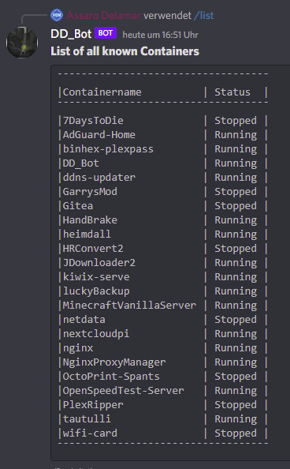

<h1 align="center">DD_Bot</h1>

A Discord-Bot to start and stop Docker Containers, using SSH

`"Conveniently, this program can be used as a Docker Container"` - ***Gadget Gabe***

<h1 align="center">Screenshots</h1>

