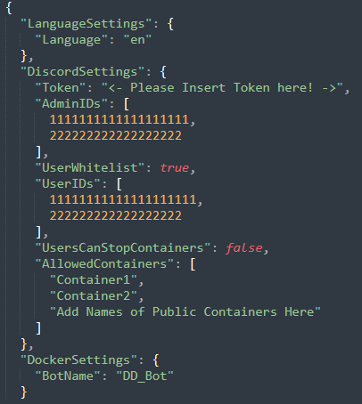
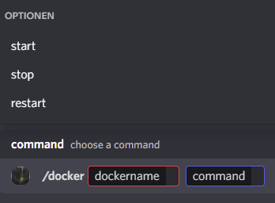

<h1 align="center">DD_Bot</h1>

A Discord-Bot to start and stop Docker Containers, using SSH

`"Conveniently, this program can be used as a Docker Container"` - ***Gadget Gabe***

## Screenshots

## Features

- Remotely start and stop Docker Containers using Discord Slash Commands
- Enable Friends to start specified Containers, e.g. Gameservers
    - Save Energy when noone is playing
- DD_Bot is designed to work on the same or a different machine in its own Container
- Easy configuration through a single json file
- Built using [Discord.NET](https://github.com/discord-net/Discord.Net) and [SSH.NET](https://github.com/sshnet/SSH.NET)

## Requirements

- Docker
- SSH Access to your servers root
- a correctly configured bot from [Discord Developer Portal](https://discord.com/developers/), instructions can be found [here](/sites/discordbot.md)
- ~160Mb storage space
- Internet connection

## [Installation](/sites/installation.md)

## [Settings](/sites/settings.md)

## [FAQ/Troubleshooting](/sites/faq.md)

## To-Do List

- [x] Initial Release
- [ ] Add option for SSH Keyfiles instead of a password
- [ ] Fully customizable messages for Discord
- [ ] More statistics
- [ ] \(Maybe) Auto-Shutdown for certain containers
- [ ] \(Maybe) more command options
- [ ] \(Maybe) implement RCON to control gameservers

### If you like my work, feel free to buy me a coffee

 

